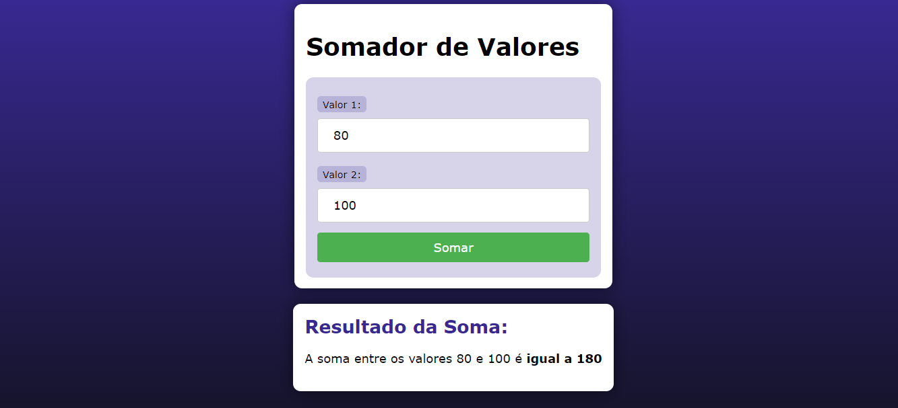

# SOMA COM PHP
👨‍🏫PROJETO CRIADO PARA O CURSO DE PHP DO CURSO EM VIDEO.

 <br>

## DESCRIÇÃO:
Este é um simples programa em PHP que permite ao usuário somar dois valores inseridos através de um formulário HTML. 

- **Título:** Somador de Valores com PHP
- **Objetivo:** Permitir que o usuário insira dois valores e calcular sua soma.
- **Tecnologias Utilizadas:** HTML, CSS e PHP.

- O programa verifica se ambos os valores foram inseridos antes de realizar a soma para evitar erros de cálculo.
- Os valores inseridos são passados através do método GET, o que significa que eles aparecerão na URL após o envio do formulário.

## EXECUTANDO O PROJETO:
1. **Executando o Aplicativo com Apache:**
   - Coloque os arquivos em um servidor web compatível com PHP (por exemplo, XAMPP, WAMP, LAMP).
   - Acesse o formulário no navegador visitando [http://localhost/CODIGO/index.php](http://localhost/CODIGO/index.php).

2. **Executando o Aplicativo com `php.exe`:**
   - Alternativamente, você pode iniciar o servidor diretamente no diretório `./CODIGO` com o comando abaixo:
   ```bash
   php -S localhost:8080
   ```
   - Em seguida, acesse o formulário no navegador através do endereço: [http://localhost:8080](http://localhost:8080).

3. **Interagir com o Projeto:**
   1. **Inserir Valores:**
      - Você verá dois campos de entrada de texto rotulados como "Valor 1" e "Valor 2".
      - Insira os valores que deseja somar nos campos correspondentes.

   2. **Efetuar a Soma:**
      - Após inserir os valores, clique no botão "Somar".

   3. **Visualizar o Resultado:**
      - O resultado da soma será exibido logo abaixo do formulário, indicando a soma dos dois valores inseridos.

   4. **Feedback de Valores Não Preenchidos:**
      - Se algum dos campos estiver vazio quando o formulário for enviado, uma mensagem será exibida indicando que ambos os valores devem ser preenchidos.
      
## CREDITOS:
- [PROJETO CRIADO PARA O CURSO DE PHP](https://github.com/VILHALVA/CURSO-DE-PHP)
- [PROJETO FEITO PELO VILHALVA](https://github.com/VILHALVA)


